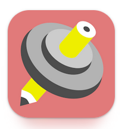
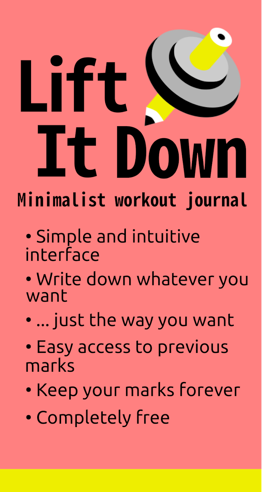
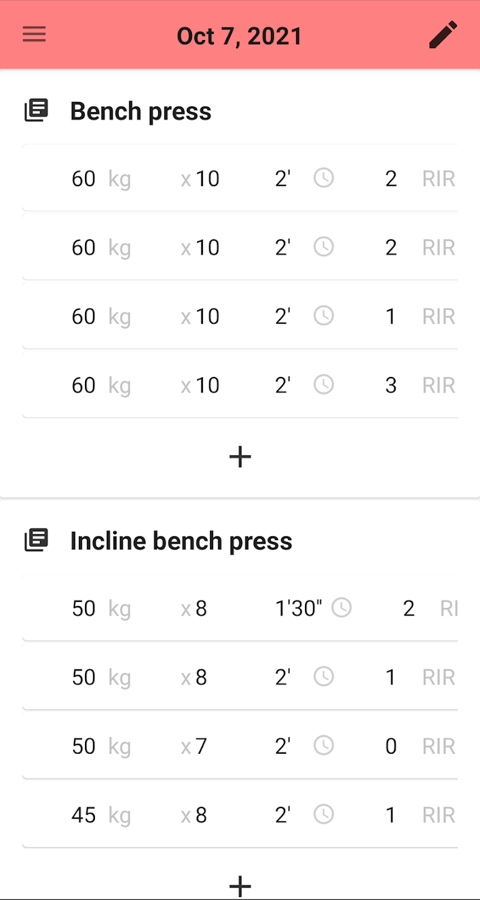
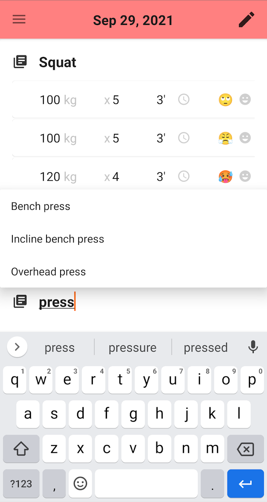
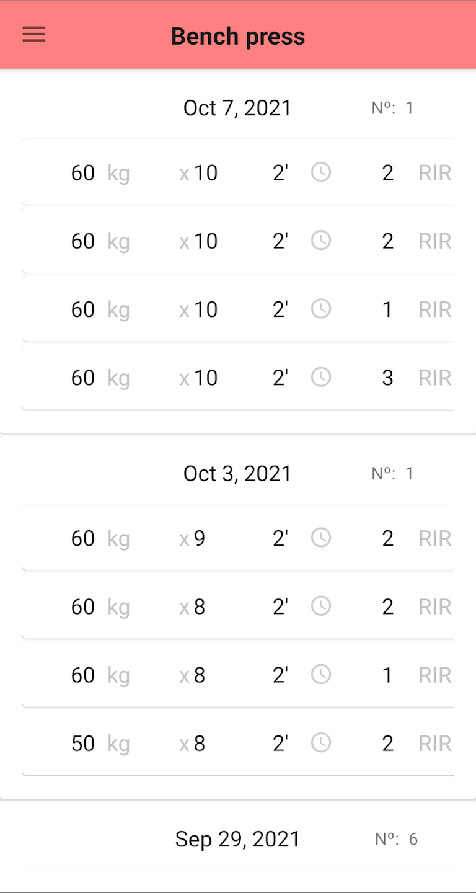
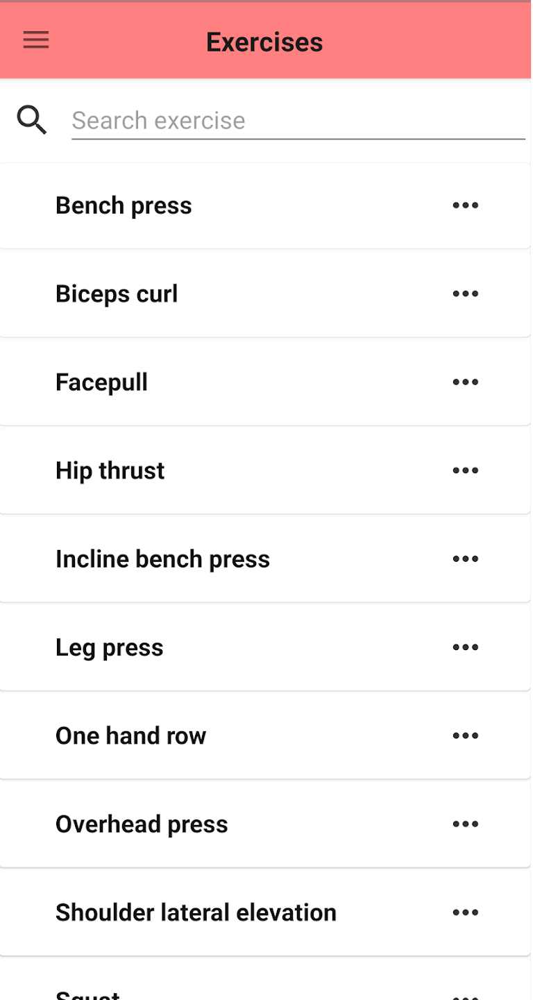
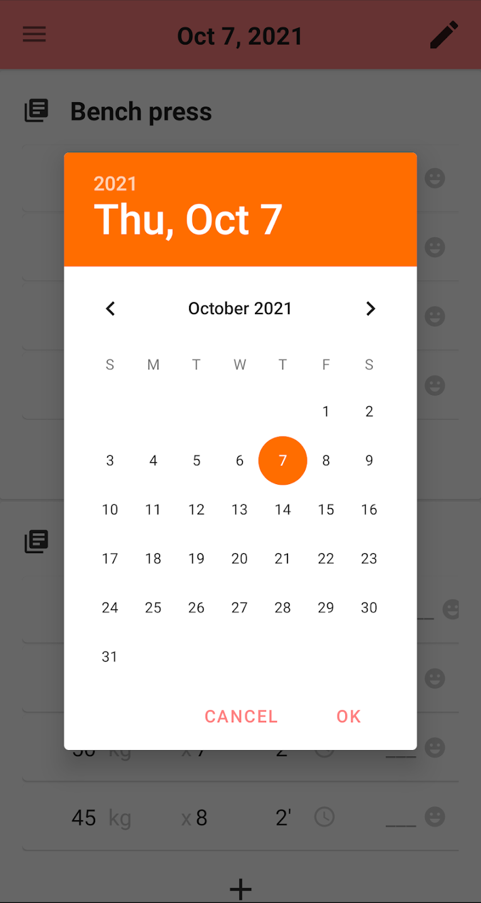
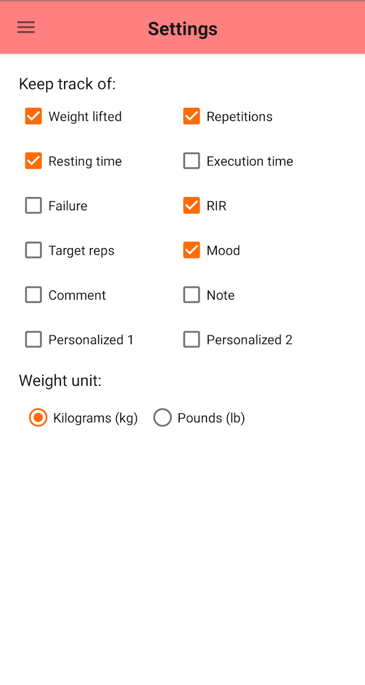

 

  

<h3 align="center">LiftItDown</h3>
  

    Minimalist workout journal
     
    <a href="https://play.google.com/store/apps/details?id=com.aleperaltagar.liftitdown"><strong>Google Play link »</strong></a>
  

[![Android][Android]](https://www.android.com/) [![Android Studio][Android Studio]](https://developer.android.com/studio)

## Description

  
  
  

**LiftItDown** is a completely free workout journal with a minimalist style that lets you write down your training marks in a simple and intuitive way. Due to its flexibility, you can write on it in any way you like, whether you are training at the gym, at the calisthenics park or at home.

**FEATURES**

• **Simple and intuitive design, inspired in classic pen and paper workout journals**: you can annotate, modify and delete your marks without exiting the main screen, as you would do in a paper journal.

• **Write whatever you want**: you can choose what to record during your training, from just the weight and repetitions to any combination between more than ten fields to choose from: resting time, RIR, target reps, mood, personal notes...

• **Write the way you want**: unlike other apps, you are not limited in what you can write, for example restricting you to writing only numbers in the weight field. Are you using elastic bands? Write "yellow band". You don't know how much the bar weighs? Write "40kg + bar". Pull ups with ballast? Then write "bodyweight + 20kg".

• **Quick access to your previous marks**: just with the press of a button you can access your previous marks for the exercise you are just doing. You can also look for any of your saved exercises using a simple and quick search bar. You also have a calendar to check which exercises you did the other day.

• **Save your marks forever**: you can easily save the whole notebook to store it in a safe place. Are you changing your phone? Export your data and import them on the new device.

• **Completely free:** no barriers or premium service. Every feature is unlocked for every user.

  
  
  
  

## Requisites

Requires Android 7.0 or up.

## License

Distributed under the GNU General Public License. See `LICENSE.txt` for more information.

## Contact

Contact: aleperaltagar@gmail.com

Project repository: [https://github.com/alexpergar/lifitdown](https://github.com/alexpergar/lifitdown)

[Google Play](https://play.google.com/store/apps/details?id=com.aleperaltagar.liftitdown), published on Oct 7, 2021.

<!-- MARKDOWN IMAGES -->
[Android Studio]: https://img.shields.io/badge/Android%20Studio-3DDC84.svg?style=for-the-badge&logo=android-studio&logoColor=white
[Android]: https://img.shields.io/badge/Android-3DDC84?style=for-the-badge&logo=android&logoColor=white